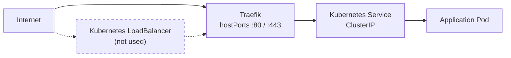

# IaC-VPS

This repository documents and automates the setup of my VPS using **Ansible** and **OpenTofu**. It is part of my home infrastructure and acts as the always-on, internet-facing extension of it.

The VPS currently runs the following services:

* **RabbitMQ** – Used as a buffer for messages produced by various services. Messages are queued here and later consumed by my home “farm” cluster, which is not always powered on.
* **OpenBao** – The central secrets store for the entire infrastructure, used by all K3s clusters as well as the VPS itself.

The VPS is connected to my [home network](https://github.com/Schwitzd/IaC-HomeRouter) via a **WireGuard** tunnel over IPv6, using a [Route64 tunnel broker](https://www.schwitzd.me/posts/mikrotik-tunnelbroker-with-route64/).

The underlying host is a small Netcup instance, the [VPS nano G11s 6M](https://www.netcup.com/de/server/vps/vps-nano-g11s-6m), with 2 GiB of RAM, running **Debian**.

## Requirements

Install the needed Ansible roles and collections:

```sh
ansible-galaxy collection install -r requirements.yaml --force
ansible-galaxy role install -r requirements.yaml --force
```

## Bootstrap

Bootstrap process will:

1. Create a dedicated VPS user
1. Provision and configure SSH public key authentication for the VPS user

```sh
# Bootstrap the VPS user
ansible-playbook -i inventory.yaml playbooks/bootstrap-user.yaml -u root --ask-pass -e 'ansible_ssh_common_args="-o PubkeyAuthentication=no -o PreferredAuthentications=password -o IdentitiesOnly=yes"'
# Boostrap SSH keys
ansible-playbook -i inventory.yaml playbooks/bootstrap-ssh.yaml -u root --ask-pass -e 'ansible_ssh_common_args="-o PubkeyAuthentication=no -o PreferredAuthentications=password -o IdentitiesOnly=yes"'
```

## Host

Provision host-level configuration (SSH hardening, base services, etc...):

```sh
ansible-playbook -i inventory.yaml playbooks/host.yaml
```

### Wireguard

After the `host` playbook has successfully created the WireGuard interface, retrieve the VPS public key with:

```sh
sudo wg show wg0 public-key
```

This key is required to configure the corresponding peer on the MikroTik router.

## K3s

Create the installation config file in `/etc/rancher/k3s/config.yaml`:

```yaml
write-kubeconfig-mode: "644"
disable-cloud-controller: true
disable:
  - servicelb
  - coredns
  - traefik
node-ip: 
  - "<ipv6-gua>"
  - "<ipv4-public>"
node-external-ip:
  - "2a03:4000:6:d90d:3825:8eff:fe0d:7047"
  - "188.68.51.201"
tls-san:
  - "vps.schwitzd.me"
secrets-encryption: true
cluster-cidr: "fd42:10:42:00::/56,10.42.0.0/16"
service-cidr: "fd42:10:43:00::/112,10.43.0.0/16"
disable-network-policy: true
kube-proxy-arg:
  - "proxy-mode=nftables"
```

Proceed with the installation:

```sh
curl -sfL https://get.k3s.io | INSTALL_K3S_VERSION="v1.34.4+k3s1" sh
```

Once Kubernetes is installed:

```sh
ansible-playbook -i inventory.yaml playbooks/k3s.yaml
```

### Argo CD

Because the VPS has small RAM capacity, it is intentionally kept lightweight and reserved for edge services. Running Argo CD directly on the VPS would provide minimal benefit while consuming resources better used by workloads. Instead, the VPS K3s cluster is registered as a remote cluster in the Argo CD instance running on the farm cluster. This allows the farm to act as a centralized GitOps control plane while keeping the VPS minimal.

Argo CD authenticates to the VPS using a dedicated ServiceAccount (`sa-argocd-manager`) and a long-lived ServiceAccount token generated explicitly for this purpose:

```sh
# Create the SA and associated RBAC
tofu apply --var-file=variables.tfvars --target=kubernetes_manifest.argocd_manager_sa --target=kubernetes_manifest.argocd_manager_crb

# Mint the token
kubectl -n kube-system create token sa-argocd-manager --duration=8760h
```

The token is generated manually, stored in Argo CD as part of the cluster registration, and rotated manually based on a scheduled reminder.

### External Secrets

Every workload secret is delivered via the External Secrets Operator, authenticated through OpenBao's `kubernetes-vps` backend. See `IaC-SecretsStore`'s [Remote clusters](https://github.com/Schwitzd/IaC-SecretsStore#remote-clusters) setup.

The dedicated `sa-openbao-tokenreview` ServiceAccount and its `system:auth-delegator` binding, which let OpenBao validate ESO's tokens, are deployed via GitOps. The only manual, one-time step is minting the long-lived reviewer JWT and registering this cluster in OpenBao, documented in `IaC-SecretsStore`.

### Traefik

This cluster does not use a Kubernetes **LoadBalancer**, as it runs on a single VPS where the node itself already owns the public IP. Instead, Traefik is configured with `hostPorts` and binds directly to the node's network interfaces on ports 80 and 443. Routing is handled via the **Gateway API** using `HTTPRoute` resources. Incoming traffic follows a simple and explicit path, avoiding unnecessary load-balancer layers:



Traefik example of port configuration:

```yaml
ports:
  websecure:
    port: 443
    hostPort: 443
    expose:
      default: true
    exposedPort: 443
```

## Swap

The VPS is a tiny instance, so a swapfile is provisioned at `/swapfile` by the `host` Ansible playbook to avoid out-of-memory kills under memory pressure.

K3s [supports swap](https://kubernetes.io/docs/concepts/cluster-administration/swap-memory-management/) as of Kubernetes 1.28, so running it alongside a swap-enabled node is a supported and tested configuration.

`vm.swappiness` is set to `10` (via `/etc/sysctl.d/99-swappiness.conf`), which strongly biases the kernel toward keeping processes in RAM and only using swap as a last resort. The default value of `60` would cause premature swapping on a low-memory host, degrading latency for running workloads.

Swap usage per pod can be inspected with:

```sh
kubectl top pods --show-swap -A
```
